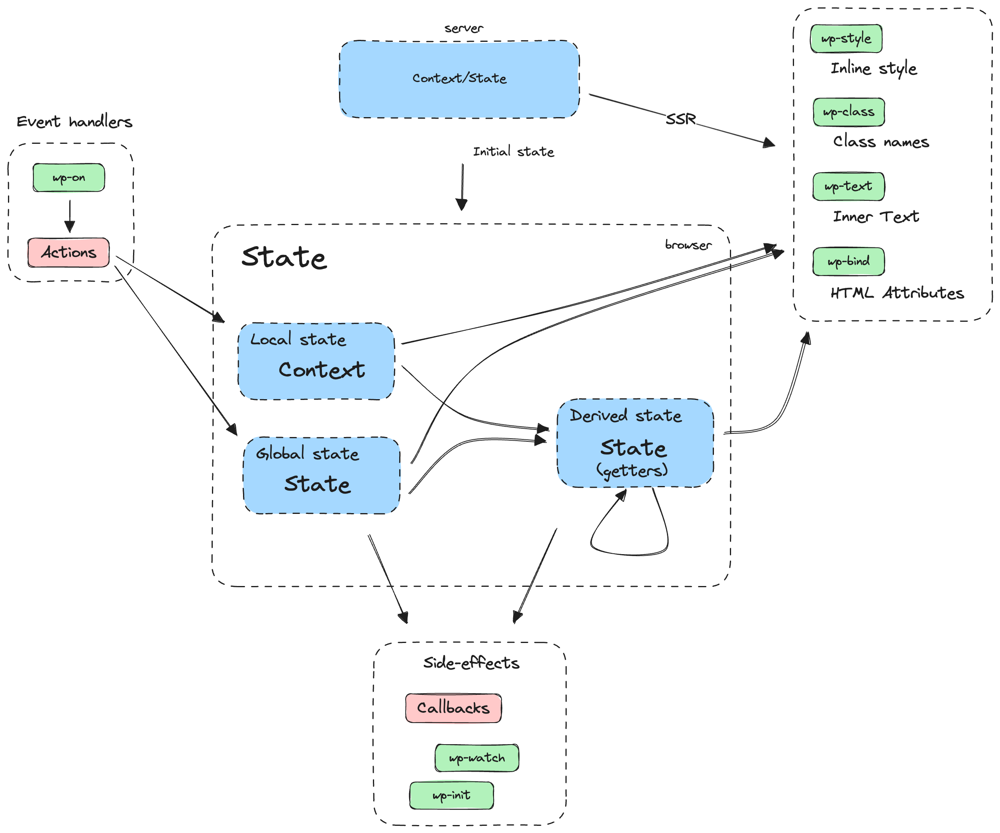

<!-- https://miriam-mueller.com/wp-content/uploads/2024/05/MarpCheatsheet.pdf -->

<!-- _class: lead -->
<!-- _paginate: skip -->

# WordPress — _Interactivity API_

Des blocs Gutenberg interactifs en quelques lignes !

## Présentation 🧑‍💻

- **Martin Beaumont**, développeur Web
- Freelance depuis 5 ans
- Différentes stacks pour différents projets
  - WordPress, Symfony, Astro
- Motivé par l'accessibilité et l'écoconception numérique

<!-- header: Historique | Découverte de l'API _Interactivity_ -->

## Gutenberg et le FSE

- Première intégration de Gutenberg dans WordPress 5.0 (2018)
- Ajout du Full Site Editing dans WordPress 6.2 (2023)

## Blocs Gutenberg

Deux types de blocs :

- les **blocs statiques**, qui sont compilés en HTML lors de l'enregistrement du modèle et sauvegardés en base de données
- les **blocs dynamiques**, seuls les attributs sont sauvegardés en base de données et un fichier de rendu en PHP est appelé lors de l'affichage de la page

Les blocs dynamiques peuvent également utiliser une partie statique, avec la méthode `save` dans `registerBlockType`.

<!-- header: _Interactivity API_ | Découverte de l'API _Interactivity_  -->

## API _Interactivity_

- Un outil prêt à l'emploi
- Fournir une API standardisée
- Se concentrer sur la logique du bloc

## Trois concepts clés

- Approche déclarative et réactive
- État global, contexte local et état dérivé
- _SSR_ / Rendu côté serveur



## Approche impérative

```html
<nav id="my-interactive-menu">
  <button id="nav-toggle">Afficher le menu</button>
  <ul id="nav-menu" hidden>
    ...
  </ul>
</nav>

<script>
  const navToggle = document.getElementById('nav-toggle');
  const navMenu = document.getElementById('nav-menu');
  
  navToggle.addEventListener('click', () => {
    if ( navMenu.hasAttribute('hidden') ) {
      navMenu.removeAttribute('hidden');
      navToggle.textContent = 'Masquer le menu';
    } else {
      navMenu.setAttribute('hidden', 'hidden');
      navToggle.textContent = 'Afficher le menu';
    }
  });
</script>
```

## Approche déclarative

```html
<nav id="my-interactive-menu" data-wp-interactive="myInteractiveMenu">
  <button
    id="nav-toggle"
    data-wp-on--click="actions.toggleVisibility"
    data-wp-text="state.visibilityText"
  >
    Afficher le menu
  </button>
  <ul
    id="nav-menu"
    data-wp-bind--hidden="!state.isVisible"
  >
    ...
  </ul>
</nav>
```

## Approche déclarative et réactive

```html
<script>
  import { store } from '@wordpress/interactivity';

  const { state } = store( 'myInteractiveMenu', {
    state: {
      isVisible: false,
      get visibilityText() {
        return state.isVisible ? 'Masquer le menu' : 'Afficher le menu';
      },
    },
    actions: {
      toggleVisibility() {
        state.isVisible = ! state.isVisible;
        if ( ! state.isVisible ) state.isActive = false;
      },
    },
  });
</script>
```

## État global

Un ensemble de données, stockées dans un _store_, pouvant être accédées et modifiées par n'importe quel bloc sur la page qui utilise l'API _Interactivity_.

La fonction `wp_interactivity_state( ?string $store_namespace = null, array $state = array() )` permet de stocker des données dans un _store_.

Les données sont également partagées côté serveur lors du rendu des différents blocs.

```php
wp_interactivity_state( 'myInteractiveMenu', array(
  'isVisible' => false,
) );
```

## État global — exemple

La définition de l'état global accepte les variables PHP.

```php
<?php

$menuIsVisible = false;

wp_interactivity_state( 'myInteractiveMenu', array(
  'isVisible' => $menuIsVisible,
) );

?>
```

```html
<nav id="my-interactive-menu" data-wp-interactive="myInteractiveMenu">
  <button
    id="nav-toggle"
    data-wp-on--click="actions.toggleVisibility"
  >
    Afficher / masquer le menu
  </button>
  <ul
    id="nav-menu"
    data-wp-bind--hidden="!state.isVisible"
  >
    ...
  </ul>
</nav>
```

## Contexte local

Le contexte local s'initialise à partir de l'attribut `data-wp-context`, qui contient une chaîne de caractères en JSON.

L'utilisation du contexte local rend chaque bloc indépendent, permettant d'avoir plusieurs instances d'un même bloc sur la page.

Les éléments enfants ont accès au contexte via `context.*`.

```html
<nav id="my-interactive-menu" data-wp-interactive="myInteractiveMenu" data-wp-context='{ "isVisible": false }'>
  <button
    id="nav-toggle"
    data-wp-on--click="actions.toggleVisibility"
  >
    Afficher / masquer le menu
  </button>
  <ul
    id="nav-menu"
    data-wp-bind--hidden="!context.isVisible"
  >
    ...
  </ul>
</nav>
```

## Contexte local — déclaration en PHP

Le contexte local peut également être défini en PHP avec la fonction
`wp_interactivity_data_wp_context( array $context, string $store_namespace = '' )`
Le _store_ est ici optionnel.

```php
<?php

$context = array( 'isVisible' => false );

?>
```

```html
<nav id="my-interactive-menu" data-wp-interactive="myInteractiveMenu" <?php echo wp_interactivity_data_wp_context( $context ); ?>>
  <button
    id="nav-toggle"
    data-wp-on--click="actions.toggleVisibility"
  >
    Afficher / masquer le menu
  </button>
  <ul
    id="nav-menu"
    data-wp-bind--hidden="!context.isVisible"
  >
    ...
  </ul>
</nav>
```

## Contexte local — exemple d'utilisation

```html
<script>
  import { store, getContext } from '@wordpress/interactivity';

  store( 'myInteractiveMenu', {
    actions: {
      toggleVisibility() {
        const context = getContext();
        context.isVisible = ! context.isVisible;
      },
    },
  });
</script>
```

## État dérivé

L'état dérivé désigne un ensemble de valeurs qui sont produites à partir des valeurs de l'état global ou du contexte local.

Trois avantages majeurs pour l'intégration :

- Source unique et de confiance
- Mises à jour automatiques
- Gestion de l'état simplifié

Ainsi que de meilleures performances et un débogage simplifié.

## État dérivé — Bonnes pratiques

L'état dérivé est recommandé pour les cas suivants :

- Calculer des valeurs selon l'état global ou le contexte local
- Éviter la duplication de valeurs et de code
- Mettre à jour automatiquement les valeurs des blocs
- Simplifier les `actions` à la mise à jour logique uniquement

Cette fonctionnalité permet de séparer la logique de gestion d'état et des valeurs qui en ~~découlent~~ _dérivent_.

## État dérivé — Exemple

```html
<nav id="my-interactive-menu" data-wp-interactive="myInteractiveMenu" data-wp-context='{ "isVisible": false }'>
  <button
    id="nav-toggle"
    data-wp-on--click="actions.toggleVisibility"
    data-wp-text="state.visibilityText"
  >
  </button>
  ...
</nav>

<script>
  import { store, getContext } from '@wordpress/interactivity';

  store( 'myInteractiveMenu', {
    state: {
      get visibilityText() {
        const { isVisible } = getContext();
        return isVisible ? 'Masquer le menu' : 'Afficher le menu';
      }
    },
    ...
  });
</script>
```

## _SSR_ / Rendu côté serveur

L'API Interactivity interprète certaines directives¹ côté serveur, aussi bien pour les blocs statiques que dynamiques.

Cette étape est faite uniquement au rendu du bloc, à l'appel de la page par exemple, et ne nécessite pas de compilation par un outil de développement.

Le _HTML_ rendu est transmit au client, sans attendre l'exécution du code par le navigateur.

Meilleures performances et point positif pour le SEO.

¹ : directives détaillées dans les diapositives suivantes

## Le _store_ et les directives

**Le _store_** contient la logique du comportement et les données.

**Les directives** ajoutées sur les éléments du DOM permettent d'intéragir avec le _store_ et de déclencher des actions.

L'API _Interactivity_ utilise des attributs HTML personnalisés, préfixés par _data-wp_, pour indiquer les directives.


## Directives — Initialisation

Deux directives permettent d'initialiser l'API _Interactivity_ sur un élément et de fournir un contexte local :

- _wp-interactive_ — active l'API _Interactivity_ sur l'élément du _DOM_ et ses enfants
- _wp-context_ — défini le contexte local sur l'élément du _DOM_ et ses enfants, possibilité d'ajouter ou d'écraser des valeurs avec la même directive sur des éléments enfants

Exemple de contextes imbriqués :

```html
<div data-wp-context='{ "foo": "bar" }'>
    <span data-wp-text="context.foo"><!-- Will output: "bar" --></span>

    <div data-wp-context='{ "bar": "baz" }'>
        <span data-wp-text="context.foo"><!-- Will output: "bar" --></span>

        <div data-wp-context='{ "foo": "bob" }'>
            <span data-wp-text="context.foo"><!-- Will output: "bob" --></span>
        </div>
    </div>
</div>
```

## Directives — Déclencheurs

Les déclencheurs exécutent les _callbacks_ indiqués, mais n'ont pas forcément accès à l'élément du _DOM_.

- _wp-run_ — s'exécute lors du rendu de l'élément du _DOM_, permet d'ajouter de la logique avec des _hooks_ comme _useState_, _useWatch_, ou _useEffect_
- _wp-init_ — s'exécute à la création de l'élément du _DOM_
- _wp-watch_ — s'exécute à la création de l'élément du _DOM_ et à l'actualisation de du _state_ ou du contexte

## Directives — Écouteurs

Les écouteurs exécutent le code ou appellent la fonction indiquée, de façon synchrone ou assynchrone.

- _wp-on--[event]_ — s'exécute de façon synchrone lorsque l'évènement se déclenche sur l'élément du _DOM_
- _wp-on-async--[event]_ — s'exécute de façon asynchrone lorsque l'évènement se déclenche sur l'élément du _DOM_
- _wp-on-document--[event]_ — s'exécute de façon synchrone lorsque l'évènement se déclenche sur l'interface _Document_
- _wp-on-async-document--[event]_ — s'exécute de façon asynchrone lorsque l'évènement se déclenche sur l'interface _Document_
- _wp-on-window--[event]_ — s'exécute de façon synchrone lorsque l'évènement se déclenche sur l'interface _Window_
- _wp-on-async-window--[event]_ — s'exécute de façon asynchrone lorsque l'évènement se déclenche sur l'interface _Window_

Les directives asynchrones doivent être privilégiées, avec des [_async actions_](https://developer.wordpress.org/block-editor/reference-guides/interactivity-api/api-reference/#async-actions).

## Directives — Affichage et _SSR_

Directives permettant d'afficher du contenu ou de modifier des attributs :

- _wp-each_ — boucle sur une liste de valeurs pour effectuer un affichage
- _wp-class--[classname]_ — ajoute ou retire une classe sur l'élément du _DOM_ selon la condition indiquée
- _wp-style--[property]_ — ajoute ou retire la propriété de style avec la valeur indiquée
- _wp-bind--[attribute]_ — ajoute ou retire l'attribut sur l'élément du _DOM_, avec ou sans valeur, selon la condition indiquée
- _wp-text_ — défini le contenu textuel de l'élément du _DOM_

Ces directives sont interprétables en _SSR_.

## Définition du _store_

```html
<script>
  import { store, getContext } from '@wordpress/interactivity';

  store( 'myInteractiveMenu', {
    state: {
      get visibilityText() {
        const { isVisible } = getContext();
        return isVisible ? 'Masquer le menu' : 'Afficher le menu';
      }
    },
    actions: {
      toggleVisibility: () => {
        const context = getContext();
        context.isVisible = ! context.isVisible;
      }
    },
    callbacks: {
      logTimeInit: () => {
        console.log('Init at' + new Date());
      },
    },
  });
</script>
```

## Définition du _store_ — Côté HTML

```html
<nav
  id="my-interactive-menu"
  data-wp-interactive="myInteractiveMenu"
  data-wp-context='{ "isVisible": false }'
  data-wp-init="callbacks.logTimeInit"
>
  <button
    id="nav-toggle"
    data-wp-on--click="actions.toggleVisibility"
    data-wp-text="state.visibilityText"
  >
  </button>
  <ul
    id="nav-menu"
    data-wp-bind--hidden="!context.isVisible"
  >
    ...
  </ul>
</nav>
```

## Pour aller plus loin

L'API _Interactivity_ propose également d'autres fonctionnalités, dont :

### Le _store_ privé

Par défaut, le _store_ est publique et accessible depuis le code, mais il peut être complètement privé ou restreint à l'utilisation d'une clé d'accès.

`const { state } = store( 'myPlugin/private', { state: { ... }, actions: { ... } }, { lock: 'PRIVATE_LOCK_KEY' | true } );`

### La navigation

La librairie `@wordpress/interactivity-router` permet de naviguer entre des pages ou de modifier une partie de la page sans rafraichissement complet. Utilisé par exemple dans le _Query Block_. [Documentation](https://developer.wordpress.org/block-editor/reference-guides/packages/packages-interactivity-router/)

### L'état et le contexte serveur

Une gestion de la navigation avec une synchronistation d'état et de contexte entre le client et le serveur, à utiliser avec la navigation de l'_Interactivity Router_. [Documentation](https://developer.wordpress.org/block-editor/reference-guides/interactivity-api/core-concepts/undestanding-global-state-local-context-and-derived-state/#subscribing-to-server-state-and-context)

## Merci 🧑‍💻

Le support de cette présentation est disponible sur GitHub : [martinbmnt.github.io/meetup-wp-interactivity/](https://martinbmnt.github.io/meetup-wp-interactivity/)

### Sources

- Documentation de l'API : [WP Developer / Block Editor Handbook / Reference Guide / Interactivity API Reference](https://developer.wordpress.org/block-editor/reference-guides/interactivity-api/)
- Diagramme de référence : [WP Developer / Block Editor Handbook / Reference Guide / Interactivity API Reference / API Reference](https://developer.wordpress.org/block-editor/reference-guides/interactivity-api/api-reference/)
- Tour d'horizon de l'API Interactivity (Benjamin Gosset) : [wordpress.tv / WordCamp TV / WordCamp Bretagne 2024](https://wordpress.tv/2024/11/29/tour-dhorizon-de-lapi-interactivity/)
- WPMovie — Interactivity API preview : [wpmovie.dev](https://wpmovies.dev/)
